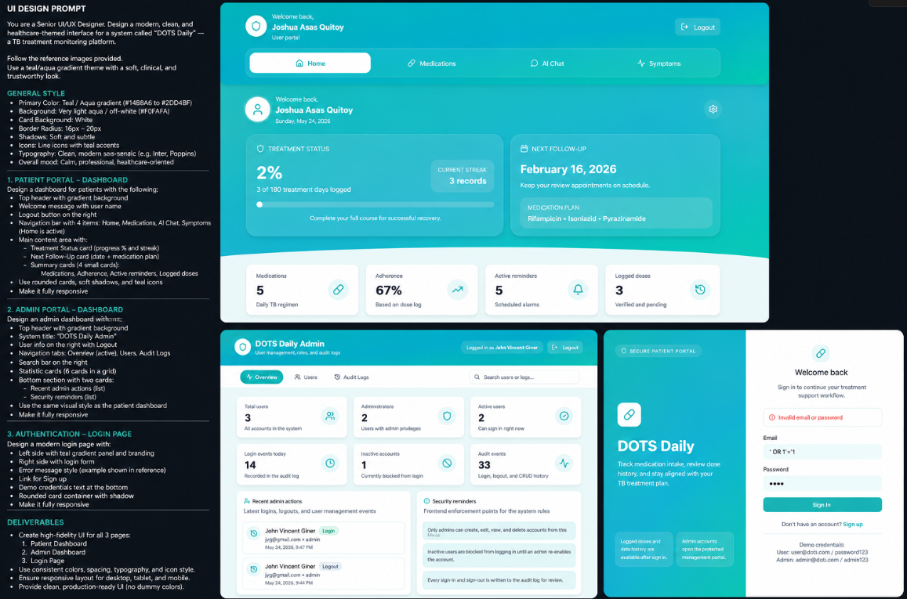

001
Project Architecture

Summary:

- Created scalable Next.js folder structure with route groups ((auth), (dashboard)), feature-based components, hooks, and lib layer (services, store, types, utils).
- Updated root layout with DOTS Daily branding and metadata.
- Replaced default create-next-app landing page with minimal project page.
- Removed Vercel boilerplate assets (SVGs) from public/.
- Created .env.example with NEXT_PUBLIC_API_URL for Laravel integration.
- Cleaned up globals.css — removed unused Tailwind v4 custom properties and dead code.
- Updated README.md with project documentation, structure map, and architecture rules.
- No UI, no auth, no CRUD — architecture only.

↓
002
Database Design

Summary:

- Designed 14-table normalized database (3NF) covering all entities.
- Simplified roles: replaced 4 RBAC tables with a single `role` ENUM('admin','patient') column on `users` — appropriate for the current 2-user-type scope.
- Added `phase` ENUM('intensive','continuation','completed') to `treatment_plans` — standard DOTS phase tracking.
- Added `proof_photo` (nullable VARCHAR) to `medication_logs` — supports photo evidence from Flutter app.
- Linked `ai_recommendations` to `daily_monitoring_id` (not treatment_plan_id) — recommendations are reactive to daily status, not long-term plans.
- Wired `daily_monitoring_id` (nullable FK) into `medication_logs` and `symptom_logs` — enables day-level treatment reconstruction while preserving independent logging from Flutter.
- Full validation pass: naming conventions, FKs, nullable fields, timestamps, indexes, cascading deletes, uniqueness — all verified.
- Reduced from 18 to 14 tables (22% reduction).
- All changes justified with thesis-appropriate rationale.
- Design saved to docs/Database.md (v2.0).

↓
003.1
Environment Configuration

Summary:

- Reviewed Laravel 13.18.0 installation (PHP 8.5.0, Composer 2.9.2).
- Configured .env for MySQL (XAMPP): DB_DATABASE=dots_daily_db, DB_HOST=127.0.0.1, DB_PORT=3306.
- Set APP_TIMEZONE=Asia/Manila in config/app.php.
- Set APP_URL=http://localhost:8000.
- Created config/cors.php with allowed origins for Next.js frontend (localhost:3000).
- Verified database connection to MySQL 'dots_daily_db' — successful.
- Created .env.example for documentation (secrets excluded).
- Ran php artisan storage:link — storage symlink created.
- Ran php artisan config:cache — configuration cached.
- All PHP extensions verified present (pdo_mysql, mbstring, xml, curl, etc.).
- No missing Composer dependencies found.

↓
003.2
Backend Architecture

Summary:

- Created API controller directory structure: Admin, Patient, Auth, AI, Notification.
- Created Services layer with domain modules: AI, Auth, Medication, Monitoring, Notification, Reports.
- Created Repositories layer for data access abstraction.
- Created Policies directory for authorization logic.
- Created Notifications directory for mail/database notification classes.
- Created Requests, Resources, and Middleware directories.
- All directories created under backend/app/ with proper Laravel conventions.

↓
003.3
Database Migrations

Summary:

- Modified existing users migration: added role (string), phone, profile_photo_path, is_active, last_login_at, softDeletes, indexes.
- Created patients: FK→users (unique), nullable medical profile fields, registered_by FK→users.
- Created treatment_plans: FK→patients, phase/status strings, start/end dates, softDeletes.
- Created medications: master catalog with name, generic_name, strength, unit, dosage_form.
- Created treatment_plan_medication: pivot with dosage/frequency/route/duration, unique constraint, restrictOnDelete for medications.
- Created daily_monitoring: vitals (weight, temp, BP, HR, RR, SpO2), FK→patients.
- Created medication_logs: FK→treatment_plan_medication, status/dose_quantity/proof_photo, FK→daily_monitoring (nullable).
- Created symptom_logs: FK→patients, symptom_type/severity/duration, FK→daily_monitoring (nullable).
- Created ai_conversations: chat session headers, FK→patients.
- Created ai_messages: FK→ai_conversations, role/content/metadata, no updated_at.
- Created ai_recommendations: FK→daily_monitoring (NOT NULL), type/severity/status, FK→users (reviewed_by).
- Created notifications: type/title/body/data JSON, FK→users (sender_id).
- Created notification_recipients: composite PK, is_read/read_at.
- Created activity_logs: polymorphic morphs, action/description/properties, no updated_at.
- All 16 migrations executed successfully against dots_daily_db.
- Fixed FK constrained() calls for singular table names (treatment_plan_medication, daily_monitoring).

↓
003.4
Eloquent Models

Summary:

- Updated User model: SoftDeletes, HasOne Patient, HasMany relationships for all FK references, isAdmin()/isPatient() helpers.
- Created Patient: BelongsTo User (user_id + registered_by), HasMany all patient-owned models (treatment plans, logs, conversations, recommendations).
- Created TreatmentPlan: BelongsTo Patient/User (assigned_by), BelongsToMany Medications via treatment_plan_medication pivot with extra columns.
- Created Medication: master catalog model, HasMany treatmentPlanMedications, BelongsToMany treatmentPlans.
- Created TreatmentPlanMedication: explicit pivot model ($table='treatment_plan_medication'), BelongsTo both sides, HasMany medicationLogs.
- Created DailyMonitoring: vitals model ($table='daily_monitoring'), BelongsTo Patient/User (recorded_by), HasMany medication/symptom logs + recommendations.
- Created MedicationLog: BelongsTo TreatmentPlanMedication/Patient/DailyMonitoring(nullable)/User(observed_by,nullable).
- Created SymptomLog: BelongsTo Patient/DailyMonitoring(nullable).
- Created AiConversation: BelongsTo Patient, HasMany messages.
- Created AiMessage: $timestamps=false, BelongsTo conversation, metadata cast to array.
- Created AiRecommendation: BelongsTo Patient/DailyMonitoring/User(reviewed_by), metadata/reviewed_at casts.
- Created Notification: BelongsTo User(sender_id), HasMany recipients, data cast to array.
- Created NotificationRecipient: composite PK pivot, setKeysForSaveQuery override, BelongsTo both sides.
- Created ActivityLog: $timestamps=false, BelongsTo User, MorphTo subject, properties cast to array.
- All 14 models confirmed loading without errors via artisan tinker.
- Fixed composite key save query on NotificationRecipient.

new roadmap

# DOTS Daily v2 Development Roadmap

> **Version:** 1.0 (Frozen)
>
> This roadmap defines the official development lifecycle of the DOTS Daily v2 thesis project. Development will follow these phases sequentially. Changes to the roadmap should only occur if required by the thesis adviser or due to critical technical issues.

---

# Phase 001 — Project Foundation ✅

**Status:** Completed

## Objectives

- Initialize Next.js frontend
- Initialize Laravel backend
- Establish monorepo project structure
- Organize frontend architecture
- Configure project folders
- Create project documentation
- Define project standards and conventions

## Deliverables

- Next.js architecture
- Laravel project
- Documentation folder
- Assets folder
- Project Constitution
- Initial README

---

# Phase 002 — Database & Domain Design ✅

**Status:** Completed

## Objectives

- Analyze the tuberculosis treatment workflow
- Design normalized database (3NF)
- Design Entity Relationship Diagram (ERD)
- Define database relationships
- Finalize database schema

## Deliverables

- Complete database blueprint
- Entity Relationship Diagram (ERD)
- Database documentation
- Relationship documentation

> **Database Status:** Frozen

---

# Phase 003 — Laravel Backend Foundation

**Status:** In Progress

## Objectives

Build the backend foundation that will support both the Next.js Admin Portal and Flutter Mobile Application.

## Tasks

- Configure Laravel environment
- Configure MySQL database
- Configure CORS
- Install and configure Laravel Sanctum
- Create database migrations
- Create Eloquent models
- Define model relationships
- Create model factories
- Create database seeders
- Organize backend folder structure

## Deliverables

- Backend foundation
- Database migrations
- Eloquent models
- Factories
- Seeders
- Sanctum configuration

---

# Phase 004 — Authentication System

## Objectives

Develop a secure authentication system shared between the web and mobile applications.

## Features

- User Registration
- User Login
- Logout
- Forgot Password
- Reset Password
- User Profile
- Token Authentication (Sanctum)

## Deliverables

- Authentication API
- Protected API routes
- Authentication middleware

---

# Phase 005 — API Foundation

## Objectives

Create a consistent and scalable RESTful API.

## Tasks

- API versioning
- Request validation
- API Resources
- Standardized JSON responses
- Exception handling
- API middleware
- Route organization

## Deliverables

- REST API foundation
- API documentation
- Standard response format

---

# Phase 006 — Admin Dashboard Foundation (Next.js)

- completed

## Objectives

Develop the reusable administration interface.

## Features

- Dashboard layout
- Sidebar navigation
- Header
- Responsive design
- Reusable UI components
- Theme support

## Deliverables

- Admin dashboard layout
- Shared UI component library

---ui design based

# Phase 007 — User Management Module

## Features

- User CRUD
- Patient management
- Search
- Filtering
- Pagination
- Profile management

## Deliverables

- User Management System

--- completed

# Phase 008 — Treatment Plan Module

## Features

- Treatment Plan CRUD
- Patient assignment
- Medication assignment
- Treatment phases
- Treatment progress

## Deliverables

- Treatment Management Module

---

# Phase 009 — Daily Monitoring Module

## Patient Features

- Daily monitoring submission
- Symptom logging
- Monitoring history

## Admin Features

- Monitor patient submissions
- Review patient progress
- View monitoring records

## Deliverables

- Daily Monitoring Module

---

# Phase 010 — Medication Management Module

## Admin Features

- Medication CRUD
- Medication scheduling

## Patient Features

- Medication logs
- Medication confirmation
- Medication proof upload

## Deliverables

- Medication Management Module

---

# Phase 011 — AI Module

## Features

- AI Chat
- AI Recommendations
- Conversation history
- Recommendation history

## Deliverables

- AI Integration
- AI Service Layer

---

# Phase 012 — Notification Module

## Features

- Medication reminders
- Treatment reminders
- System notifications
- Notification history
- Read status tracking

## Deliverables

- Notification System

---

# Phase 013 — Reports & Analytics

## Features

- Dashboard analytics
- Treatment statistics
- Medication adherence reports
- Daily monitoring reports
- AI usage analytics
- Exportable reports

## Deliverables

- Reports Module
- Analytics Dashboard

---

# Phase 014 — Flutter Mobile Integration

## Objectives

Connect the Flutter mobile application to the Laravel backend.

## Features

- Authentication
- Daily Monitoring
- Medication Logging
- AI Chat
- Notifications
- Profile Management

## Deliverables

- Mobile application integration

---

# Phase 015 — Testing & Quality Assurance

## Tasks

- Backend testing
- API testing
- Frontend testing
- Manual testing
- Bug fixing
- Performance optimization

## Deliverables

- Stable production-ready application

---

# Phase 016 — Deployment Preparation

## Tasks

- Production configuration
- Security review
- Performance optimization
- Environment configuration
- Final documentation

## Deliverables

- Deployment-ready application

---

# Phase 017 — Thesis Finalization

## Tasks

- Technical documentation
- User manual
- System screenshots
- Architecture diagrams
- Presentation materials
- Final system demonstration

## Deliverables

- Complete thesis project
- Documentation package
- Defense-ready presentation

---

# Development Workflow

Every module and feature must follow this sequence:

1. Planning
2. Database Impact Review (if applicable)
3. Laravel Backend Development
4. REST API Development
5. Next.js Frontend Development
6. Flutter Integration (when applicable)
7. Testing
8. Documentation

---

# Scope Freeze

The following core features define the final scope of the project.

## Patient

- Authentication
- User Profile
- Treatment Plan
- Daily Monitoring
- Medication Logs
- Symptom Logs
- AI Chat
- AI Recommendations
- Notifications

## Administrator

- Dashboard
- User Management
- Treatment Plan Management
- Medication Management
- Daily Monitoring Review
- Reports
- Analytics
- Notifications
- Activity Logs

---

# Definition of Done

A development phase is considered complete only when all of the following are satisfied:

- Backend implementation completed
- API completed
- Frontend completed
- Flutter integration completed (if applicable)
- Validation implemented
- Error handling implemented
- Loading states implemented
- Empty states implemented
- Responsive design verified
- Manual testing completed
- Documentation updated

---

# Project Rules

- Follow the PROJECT_CONSTITUTION.md document.
- The database schema is frozen after Phase 002 unless approved changes are required.
- All frontend applications must communicate with the backend exclusively through the Laravel REST API.
- Business logic belongs in the Laravel backend.
- Maintain clean architecture, reusable components, and consistent coding standards throughout the project.
